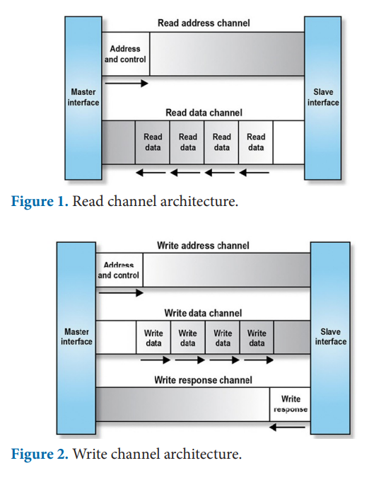
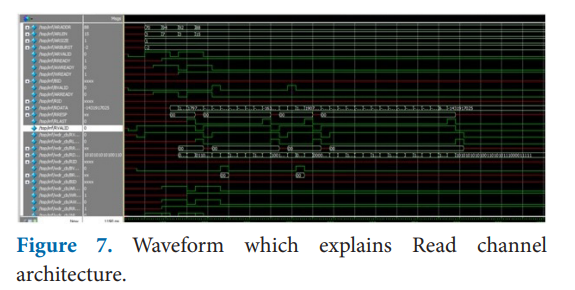
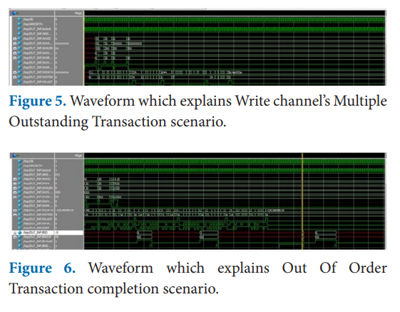

# 🚀 AXI4 Verification IP (VIP) using UVM

> **A comprehensive SystemVerilog UVM-based Verification IP for AXI4 Protocol**

<div align="center">


[Features](#-features) • [Architecture](#-architecture) • [Simulation Results](#-simulation-results) • [Getting Started](#-getting-started) • [Contact](#-author)

</div>

---

## 📋 Overview

This project implements a **complete UVM-based Verification IP for the AXI4 protocol**, enabling comprehensive functional verification of AXI4 master and slave devices. Developed with a focus on modularity and industry-standard verification methodologies, this VIP is ready for integration into complex SoC environments.

### Key Characteristics:
* ✅ **Full AXI4 Compliance:** Supports all 5 channels and complex burst types.
* ✅ **Advanced Features:** Handles Multiple Outstanding Transactions and Out-of-Order completions.
* ✅ **Robust Verification:** Includes SVA protocol assertions and a Golden Memory Scoreboard.
* ✅ **Automated Workflow:** Full regression and coverage collection via Makefile.

---

## 🏗️ Architecture

The VIP is built on a modular UVM architecture, allowing independent control over Read and Write channels to simulate real-world high-performance bus traffic.

### AXI4 Channel Flow
<p align="center">
  
  <br>
  <em>Figure 1: High-level architectural flow of AXI4 Read and Write channels.</em>
</p>

### UVM Environment Hierarchy
┌─────────────────────────────────────────────────┐
│              TESTBENCH (axi_top.sv)             │
│  ┌──────────────────────────────────────────┐  │
│  │        ENVIRONMENT (env.sv)              │  │
│  │  ┌─────────────┐      ┌─────────────┐  │  │
│  │  │  Master UVC │      │  Slave UVC  │  │  │
│  │  ├─────────────┤      ├─────────────┤  │  │
│  │  │   Master    │      │    Slave    │  │  │
│  │  │   Agent     │      │    Agent    │  │  │
│  │  └─────────────┘      └─────────────┘  │  │
│  │  ┌──────────────────────────────────┐  │  │
│  │  │      Scoreboard & Coverage       │  │  │
│  │  └──────────────────────────────────┘  │  │
│  └──────────────────────────────────────────┘  │
└─────────────────────────────────────────────────┘


---

## 🚀 Simulation Results

These waveforms, captured via QuestaSim, validate the VIP's ability to handle advanced AXI4 protocol scenarios.

### 1. Read Channel Architecture Verification
Demonstrates the handshake synchronization between Address and Data phases.
<p align="center">
  
</p>

### 2. Multiple Outstanding & Out-of-Order Transactions
Verification of high-performance scenarios where the bus issues multiple requests before receiving responses.
<p align="center">
  
  <br>
  <em>Top: Multiple Outstanding Transactions | Bottom: Out-of-Order completion tracking.</em>
</p>

---

## 🎯 Features & Components

### 🔧 Master & Slave Agents
* **Master Agent:** Configurable burst types (FIXED, INCR, WRAP) and address randomization.
* **Slave Agent:** Byte-addressable memory model with configurable response latency.

### 📊 Verification Metrics
* **Scoreboard:** Real-time data integrity checking against a Golden Memory model.
* **Functional Coverage:** Tracks address ranges, burst lengths, and WSTRB patterns.
* **Assertions (SVA):** Non-intrusive protocol compliance verification for signal timing.
---

## 🔧 Getting Started

### Prerequisites
* **Simulator:** QuestaSim 2021.1+
* **Methodology:** UVM 1.2 or IEEE 1800.2

### Quick Start

```bash
# Compile the entire environment
make comp

# Run a specific test with randomization
make run TEST=incr_burst_test SEED=12345

# View coverage reports
make cov
